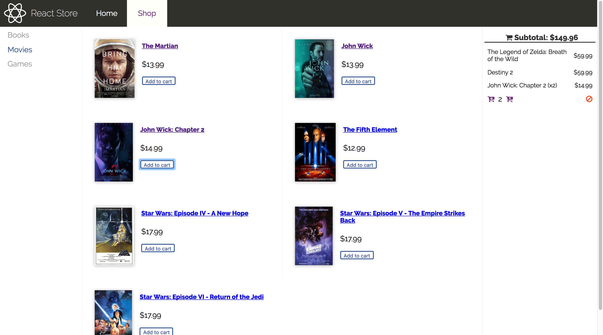

# React Store
[React Store](https://jgrim-react-store.herokuapp.com/) is a sample e-commerce web application that's unsurprisingly built with React. The application retrieves products from a MySQL database, and then uses external APIs to load detailed product information and images. The application also has a cart feature that allows the user to add items, manipulate quantity and remove from cart, and the state of the cart is preserved as the user navigates the application.

## Technology Stack
React Store is built with:
- React
- React-Router
- Express
- Node
- MySQL
- Deployed to Heroku

## Screenshots
**Product table and shopping cart**

